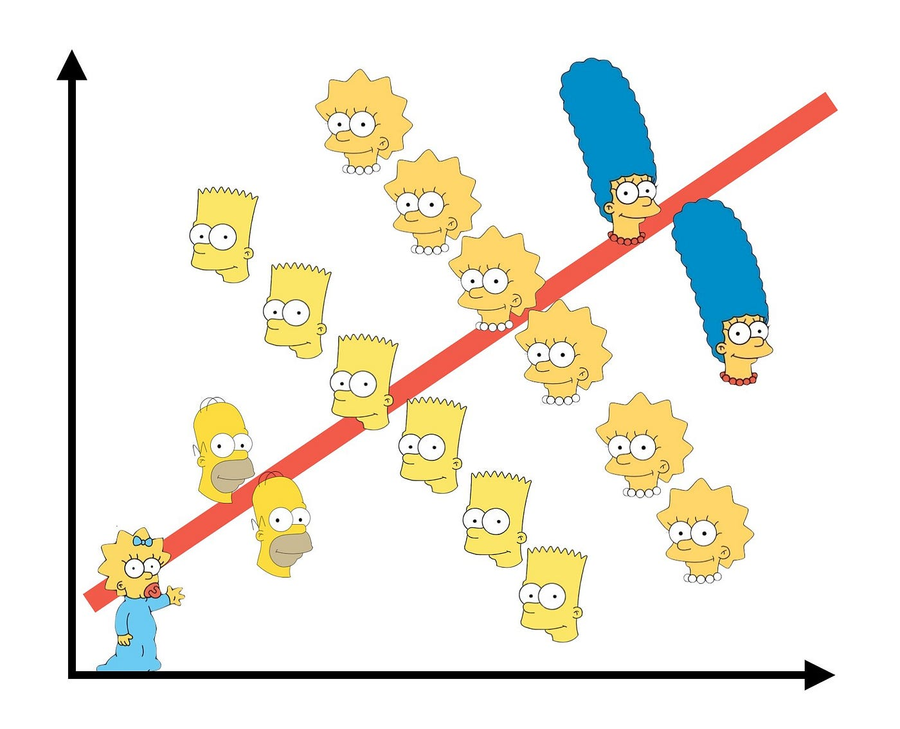

```{r}
#| label: setup
#| include: false
library(dplyr)
library(tidyr)
library(ggplot2)
theme_set(theme_minimal(base_size = 12))
```

In 1973 the graduate school at Berkeley admitted about 44% of men who applied and about 30% of women. Thousands of applicants sit behind those two numbers, so the gap is not noise. Split the same applicants by department and it very nearly disappears. In the largest department of all, women were admitted at a higher rate than men.

Nothing was recounted. The two statements are about the same people.

{width="520px" fig-alt="Scatter plot of Simpsons characters. Within each character the points slope downward, but the fitted line through all of them slopes upward."}

## What the Berkeley numbers look like

R ships with the data, so you can check this in four lines.

```{r}
#| label: tbl-depts
#| tbl-cap: "Admission rates by department, six largest departments, Berkeley 1973."

rates <- as.data.frame(UCBAdmissions) |>
  group_by(Dept, Gender) |>
  summarise(applicants = sum(Freq),
            admitted   = sum(Freq[Admit == "Admitted"]),
            .groups    = "drop") |>
  mutate(rate = admitted / applicants)

rates |>
  select(Dept, Gender, applicants, rate) |>
  pivot_wider(names_from = Gender, values_from = c(applicants, rate)) |>
  transmute(Department    = Dept,
            `Men applied` = applicants_Male,
            `Men admitted` = sprintf("%.0f%%", 100 * rate_Male),
            `Women applied` = applicants_Female,
            `Women admitted` = sprintf("%.0f%%", 100 * rate_Female)) |>
  knitr::kable(align = "lrrrr")
```

Departments A and B admitted more than 60% of everyone who applied. Departments C through F admitted far fewer. Men applied overwhelmingly to A and B; women applied overwhelmingly to C through F.

```{r}
#| label: fig-rates
#| fig-cap: "Admission rate by department and gender. Point size is the number of applicants. Dashed lines are the pooled rates."
#| fig-width: 7
#| fig-height: 3.6

pooled <- rates |>
  group_by(Gender) |>
  summarise(rate = sum(admitted) / sum(applicants))

ggplot(rates, aes(Dept, rate, colour = Gender)) +
  geom_hline(data = pooled, aes(yintercept = rate, colour = Gender),
             linetype = "dashed", linewidth = 0.4) +
  geom_point(aes(size = applicants)) +
  scale_y_continuous(labels = scales::percent) +
  scale_size_area(max_size = 8) +
  labs(x = "department", y = "admission rate", colour = NULL, size = "applicants")
```

The dashed lines are far apart. The points are not.

## Why ratios can do this

A pooled rate is a weighted average of the department rates,

$$
\bar r = \sum_d w_d \, r_d, \qquad w_d = \frac{n_d}{\sum_k n_k},
$$

and the weights $w_d$ are part of the data, not a constant you can divide out. Men and women faced the same $r_d$ but carried different $w_d$, and the difference in weights is bigger than the differences in rates. Pooling therefore measures something nobody intended to measure: where each group chose to apply.

## Why it feels impossible

Counts behave the way intuition expects. If men outnumber women in every department, they outnumber women overall, always. We quietly extend that rule to percentages, and for percentages it is false. Adding a fraction to a fraction means adding numerators and denominators separately, and the denominators are free to move.

The phenomenon predates its name by half a century. Pearson noticed in 1899 that mixing two populations manufactures correlations that exist in neither, and Yule gave the contingency-table version in 1903. Simpson's 1951 paper worked out what the reversal means for interpreting interaction, and Blyth attached his name to it in 1972. Yule had it first, which is why some writers call it the Yule-Simpson effect.

One thing the Berkeley example does not show is that there was no discrimination. Bickel and his coauthors, writing in *Science* in 1975, made that point themselves: conditioning on department moves the question rather than closing it, since departments differ in funding and capacity, and applicants do not choose where to apply in a vacuum.

## Takeaway

A pooled comparison is an average, and an average has weights. When two groups are averaged with different weights, the pooled numbers can point the opposite way from every group inside them. Before you read anything into a headline rate, find out what is being averaged and how the weights differ. The reversal is not a rare pathology; it is what happens whenever composition and outcome are related.

Admissions counts are `UCBAdmissions` in R's `datasets` package, from Bickel, Hammel and O'Connell (1975), *Science* 187, 398–404.
